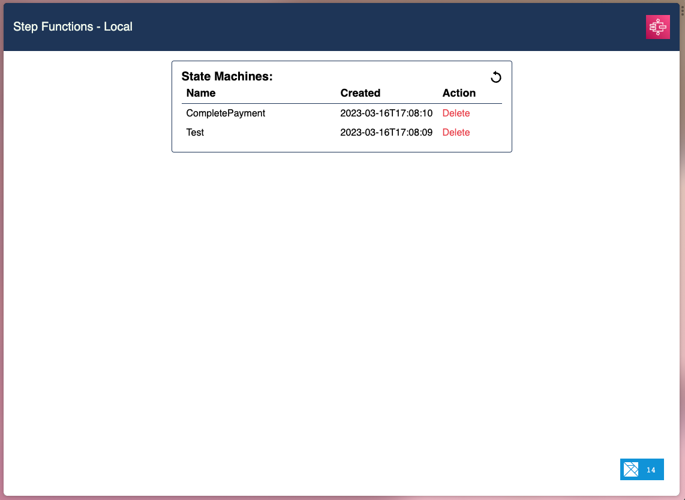

# Step Functions Local UI
If you've ever used `serverless-step-functions-local` plugin for serverless framework, it's probable that you've desired some form of visualization for your local step function executions.

Well, this is it 🤟

First screen shows your local state machines.


### Prerequisites
- Elm
  - https://guide.elm-lang.org/install/elm.html
- Rust
  - https://www.rust-lang.org/tools/install

#### Install client's dependencies
```shell
npm i
```

#### Start BE on port `6969`
```shell
cd server | cargo run
```
